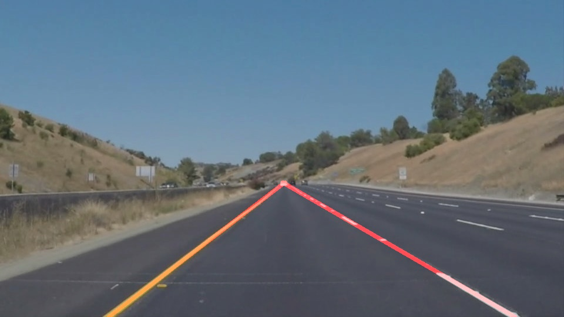
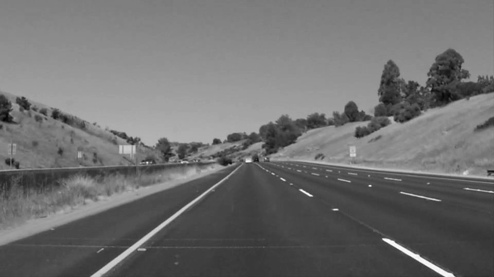
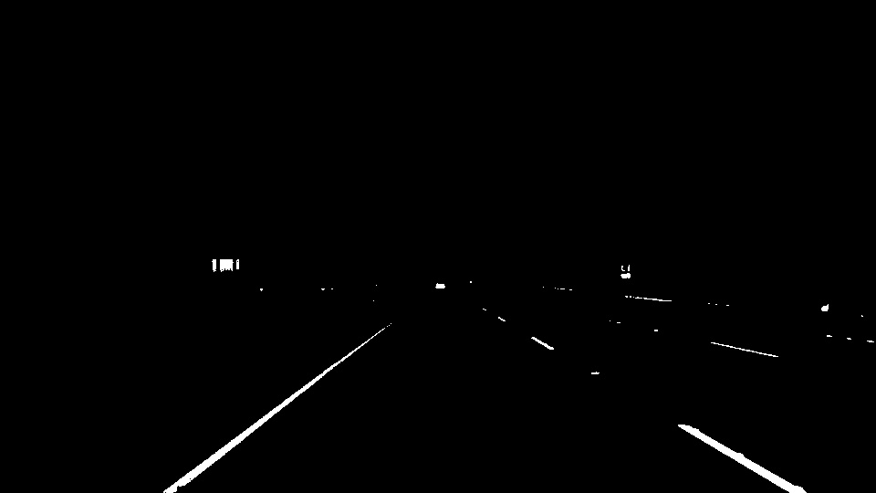
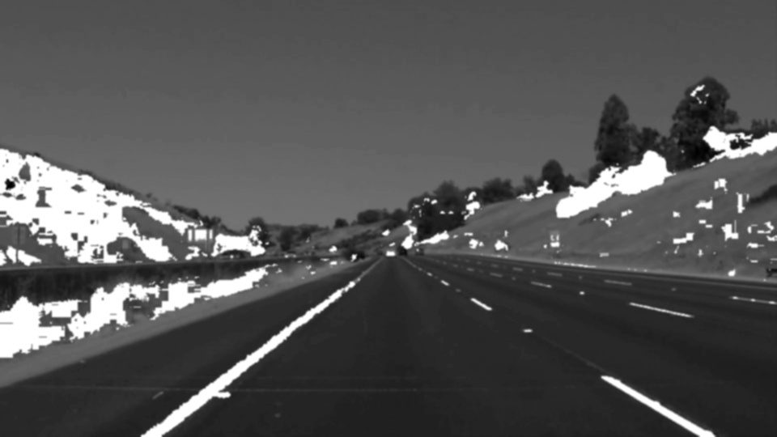
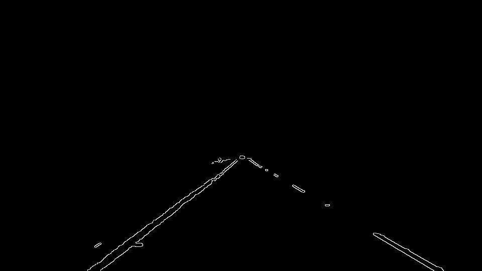
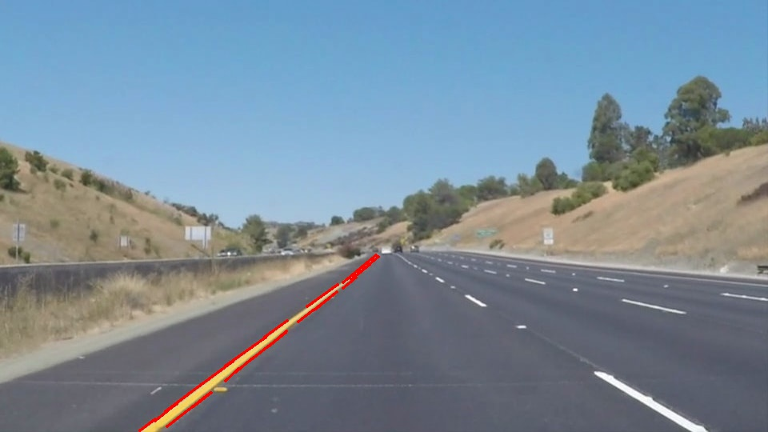
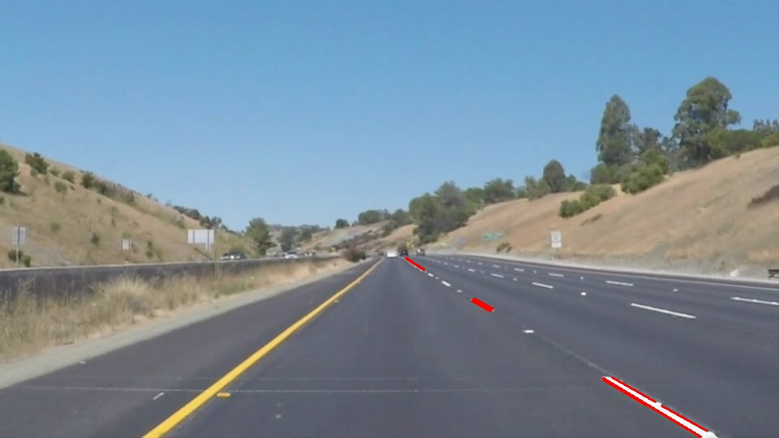

# **Finding Lane Lines on the Road** 

---

**Finding Lane Lines on the Road**

The goals / steps of this project are the following:
* Make a pipeline that finds lane lines on the road

**Example Input image**

**Example Output image**

---

### Reflection

### 1. I explain my pipleline

##### My pipeline consisted of 11 steps. 
First, I convert image to grayscale. Then, I use helper function 'grayscale()'.

Second, in order to find yellow lane lines, convert image to hsv color space from rgb color space. And, using cv2.inRange() function, Find yellow area from hsv image. Then, example output image is below.

Third, apply a color mask to grayscale image, judge it to be white when it is above the threshold vale, and find white lane. Then, the output image is below.

Fourth, combine two images only extracted only white and only yellow, Using cv2.bitwise_or() function.Then, the output image is below.

Fifth, combine color mask image and grayscale image. The output iamge is below.

Next, apply gaussian blur to combine image.

Next, apply canny edges detection.

Next, region masking.

Next, get lines-array using hough transform. And, divide into two arrays. The two arrays are divided depending wheter they belong to the left side or to the right side of the image.

Show the image in which the array having left lines is drawn.

Show the image in which the array having right lines is drawn.

Calculate a slope and intercept of the straight line from each array.
draw each line based on the slope and intercept.
This is the output image below.

### 2. Identify potential shortcomings with your current pipeline
1. It is easily affected by the weather. When the sun is strong, it becomes difficult to recognize the white line on the road. I recognize many points as edges. 
2. Cracks on the road are recognized as edges, and when taking slope, intercept and average, it becomes an outlier value.

### 3. Suggest possible improvements to your pipeline

A possible improvement would be to Perform histogram conversion to make it easier to find white lines.

